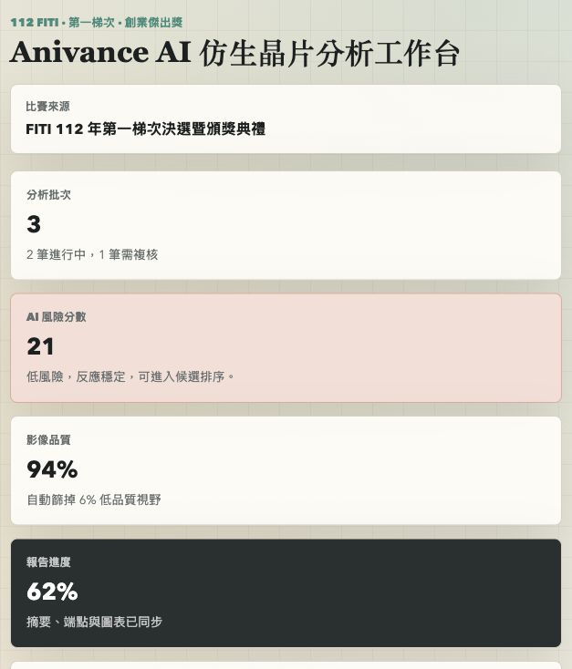
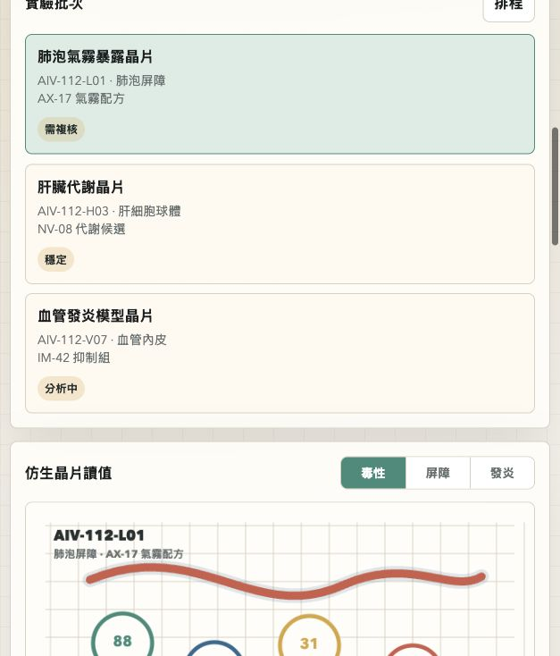

# Anivance AI Biochip Workbench

## 快速看懂

- 線上 Demo：https://atlasforcn.github.io/startup-anivance-ai-biochip/
- 這個原型在做什麼：把 Anivance AI 做成 AI 生物晶片分析工作台，呈現實驗樣本、晶片訊號與模型判讀。
- 特色定位：特色是把深科技題目轉成研究人員能看的資料流程，而不是只放一張 AI 分析圖。
- 操作流程：選擇樣本與晶片批次 → 查看訊號品質、模型判讀與風險提示 → 輸出分析摘要與後續實驗建議

展開完整功能流程截圖

這個 repo 是依據 `Anivance AI` 在 FITI 創新創業激勵計畫中的得獎概念做出的前端原型。原型把「人體仿生器官晶片、3D 仿生組織、動態氣霧呼吸系統、自動化分析和 AI 生物分析軟體」理解成一個仿生晶片實驗與 AI 判讀工作台。

## 比賽來源

- 比賽/計畫：FITI 創新創業激勵計畫
- 年度：112 年
- 屆次/階段：112 年第一梯次決選暨頒獎典禮
- 獎項：創業傑出獎
- 團隊名稱：Anivance AI
- 主辦：國家科學及技術委員會
- 執行：國家實驗研究院科技政策研究與資訊中心
- 官方來源：https://fiti.stpi.niar.org.tw/global/17a277c2bf944081b748c9c8f5261beb

## 核心概念

Anivance AI 的官方得獎說明提到人體仿生器官晶片、3D 仿生組織、動態氣霧呼吸系統、自動化分析和 AI 技術。這個原型把概念拆成四個可以軟體化的流程：

- 實驗批次管理：管理肺部、肝臟、血管等仿生晶片的樣本、狀態與分析批次。
- 晶片讀值儀表板：呈現細胞存活率、屏障完整性、發炎反應與影像品質。
- AI 生物分析：依照劑量、讀值與異常訊號產生風險分數與建議。
- 報告整理：把實驗端點、AI 判讀與候選藥物排序整理成可交付摘要。

## 原型範圍

這是靜態前端原型，資料皆為模擬。它不代表原團隊正式產品，也未使用原團隊未公開資料、商標素材或後端服務。

## 使用方式

用瀏覽器開啟 `index.html`，或透過主整理網站的原型連結進入。
